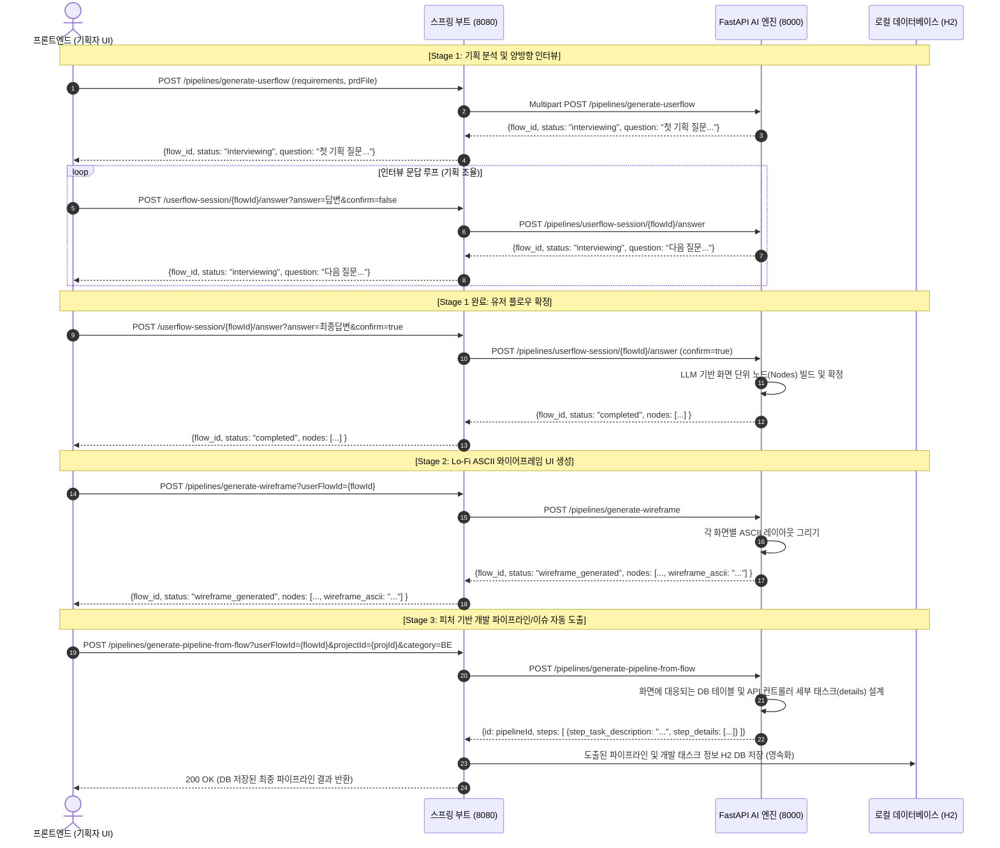

# 🎨 FitHub 3단계 AI 파이프라인 API 연동 & 시퀀스 가이드

본 문서는 **유저 플로우 설계(Stage 1) ➡️ 와이어프레임 렌더링(Stage 2) ➡️ 개발 파이프라인 생성(Stage 3)**으로 이어지는 전체 API 흐름과 포트별 데이터 연동 시퀀스를 정의합니다.

---

## 🔄 전체 시퀀스 다이어그램 (Sequence Diagram)

프론트엔드(Client), 스프링 부트 게이트웨이(Port 8080), FastAPI AI 엔진(Port 8000), 그리고 H2 데이터베이스 간의 실시간 트랜잭션 흐름입니다.



---

## 📝 단계별 API 상세 호출 가이드

### 1️⃣ Stage 1: 기획서 분석 및 대화형 인터뷰 세션 수립
* **목적**: 불명확한 서비스 기능 요구사항을 정제하고, 최종 합의된 화면 플로우 단위(`User Flow Nodes`)를 정의합니다.

#### **Step A: 최초 분석 및 첫 질문 받기**
* **URL**: `POST http://localhost:8080/pipelines/generate-userflow`
* **타입**: `multipart/form-data`
* **요청 바디**:
  * `projectId`: `103` (스프링 프로젝트 ID)
  * `requirements`: `"당일 운동 무게 기록 및 주간 대시보드 시각화 기능"`
  * `techStack`: `"Spring Boot, React Native"` (선택)
  * `prdFile`: `[기획서 PDF 파일]` (선택)
* **응답 필드 설명**:
  * `flow_id`: 생성된 기획 인터뷰 세션 ID. **(이후 단계에서 계속 식별자로 사용되므로 클라이언트에 보관 필수)**
  * `question`: 기획 구체화를 위해 AI가 작성한 추가 질문.

#### **Step B: 보완 답변 제출 및 최종 확정**
* **URL**: `POST http://localhost:8080/pipelines/userflow-session/{flowId}/answer`
* **파라미터 (Query)**:
  * `answer`: `"루틴 커스텀 기능과 저녁 9시 리마인드 알림도 넣어주세요."`
  * `confirm`: `true` (기획 조율이 다 되었다면 `true`를 넣어 확정 프로세스를 실행합니다)
* **응답 예시**:
  ```json
  {
    "flow_id": 14,
    "status": "completed",
    "nodes": [
      {
        "id": 110,
        "name": "메인 대시보드 화면",
        "description": "주간 운동 통계 그래프와 루틴 추천 바로가기 제공",
        "node_type": "screen",
        "sequence_order": 1
      }
    ]
  }
  ```

---

### 2️⃣ Stage 2: 화면 단위 와이어프레임 자동 설계
* **목적**: 확정된 유저 플로우 노드의 각 화면 설명(`description`)을 렌더링 가능한 ASCII 레이아웃 문자열로 구체화합니다.
* **URL**: `POST http://localhost:8080/pipelines/generate-wireframe`
* **파라미터 (Query)**:
  * `userFlowId`: `14` (Stage 1에서 도출된 `flow_id`)
* **핵심 반환 데이터**:
  * 각 노드 내부의 `wireframe_ascii` 필드에 화면 레이아웃 텍스트가 삽입됩니다. 프론트엔드는 이 텍스트를 `<pre style="font-family: monospace;">` 태그 내부에 그대로 매핑하여 화면에 출력할 수 있습니다.

---

### 3️⃣ Stage 3: 버티컬 슬라이스(FE/BE) 개발 태스크 리스트 적재
* **목적**: 화면 구조와 연계된 도메인 엔티티, API 엔드포인트 설계서 및 개발 이슈 카드를 자동으로 도출하고 영속 DB에 저장합니다.
* **URL**: `POST http://localhost:8080/pipelines/generate-pipeline-from-flow`
* **파라미터 (Query)**:
  * `userFlowId`: `14` (인터뷰 세션 ID)
  * `projectId`: `103` (스프링 프로젝트 ID)
  * `category`: `BE` (또는 `FE`)
* **핵심 반환 데이터**:
  * `steps`: AI가 분할한 파이프라인 단계 배열.
  * `step_task_description`: 해당 단계에서 구현할 핵심 피처 (예: `"운동 일지 등록 API 개발"`)
  * `step_details`: 기획 분석을 기반으로 자동 작성된 **DB 설계, API 설계, 비즈니스 로직 설계, 단위 테스트 코딩 목록**.

---

## 💡 프론트엔드 연동 꿀팁 (React / Axios 가이드)

1. **상태 관리**:
   * 기획 질문 폼을 렌더링할 때 `flow_id`와 `status`를 로컬 상태(`useState`)로 관리하십시오.
   * `status === "interviewing"` 일 경우 텍스트 입력창과 **[답변 전송]**, **[기획 확정하기 (confirm=true)]** 버튼 두 개를 노출하면 기획자가 편하게 진행할 수 있습니다.
2. **와이어프레임 출력**:
   * API에서 내려오는 `wireframe_ascii`는 개행 문자(`\n`)가 포함된 고정폭 텍스트이므로 CSS에 `white-space: pre-wrap; font-family: monospace;` 스타일을 주면 터미널처럼 깔끔하고 균일하게 정렬되어 노출됩니다.
